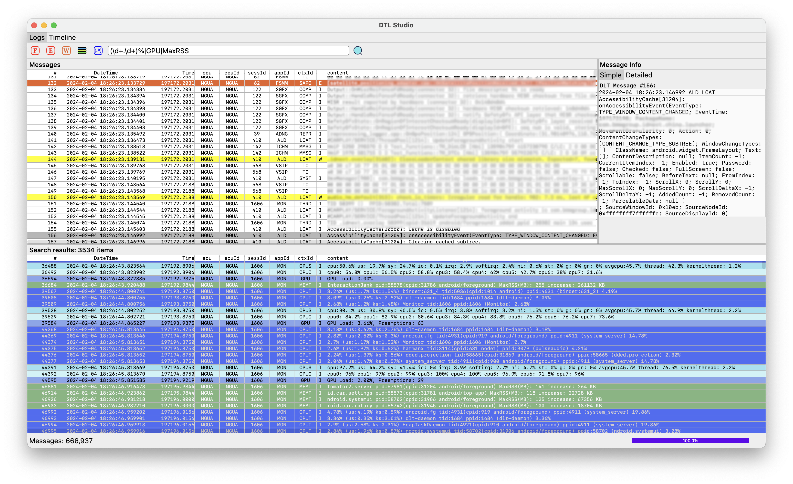
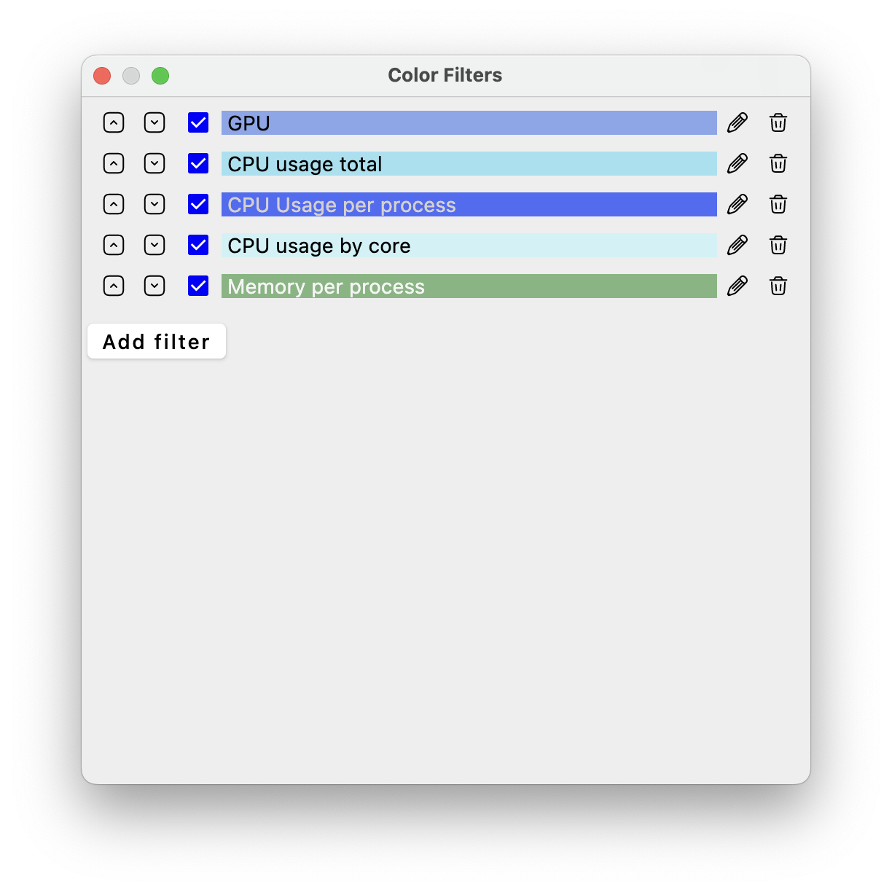
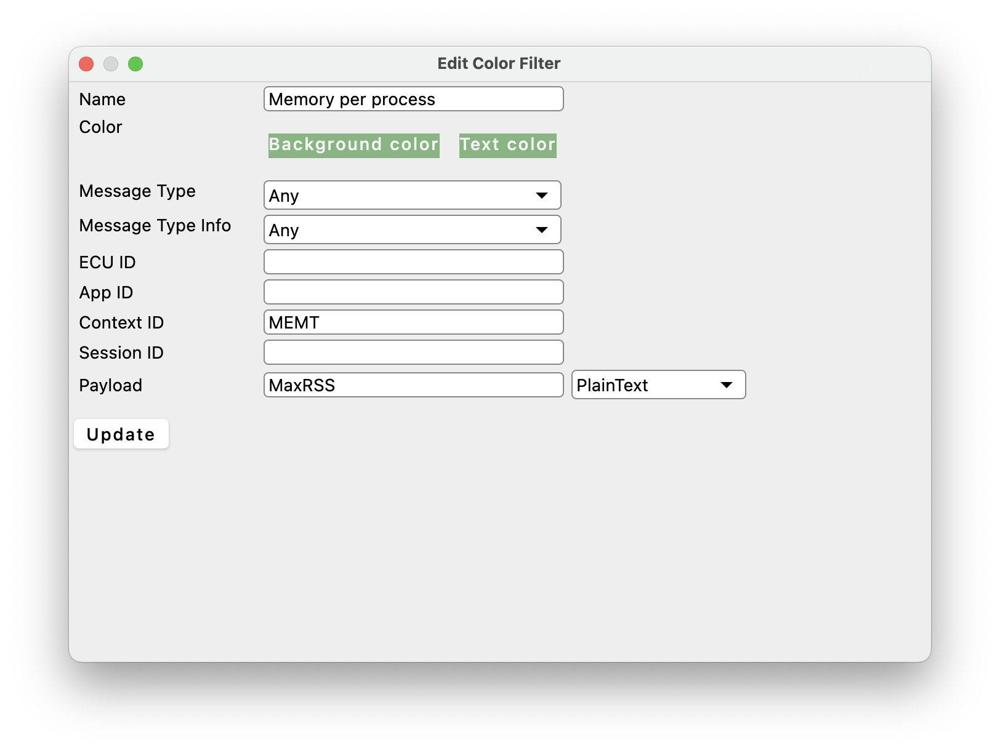
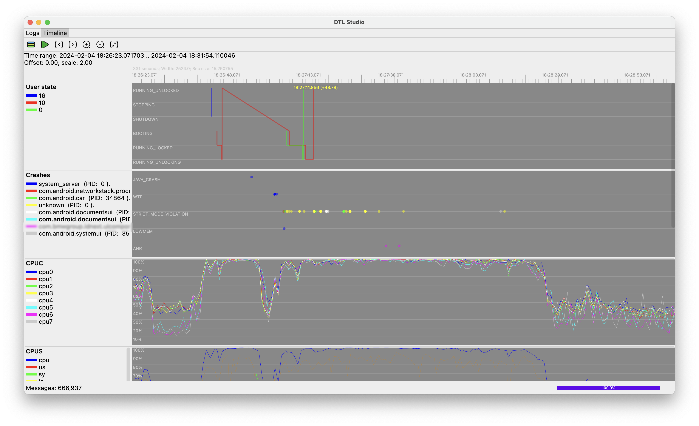
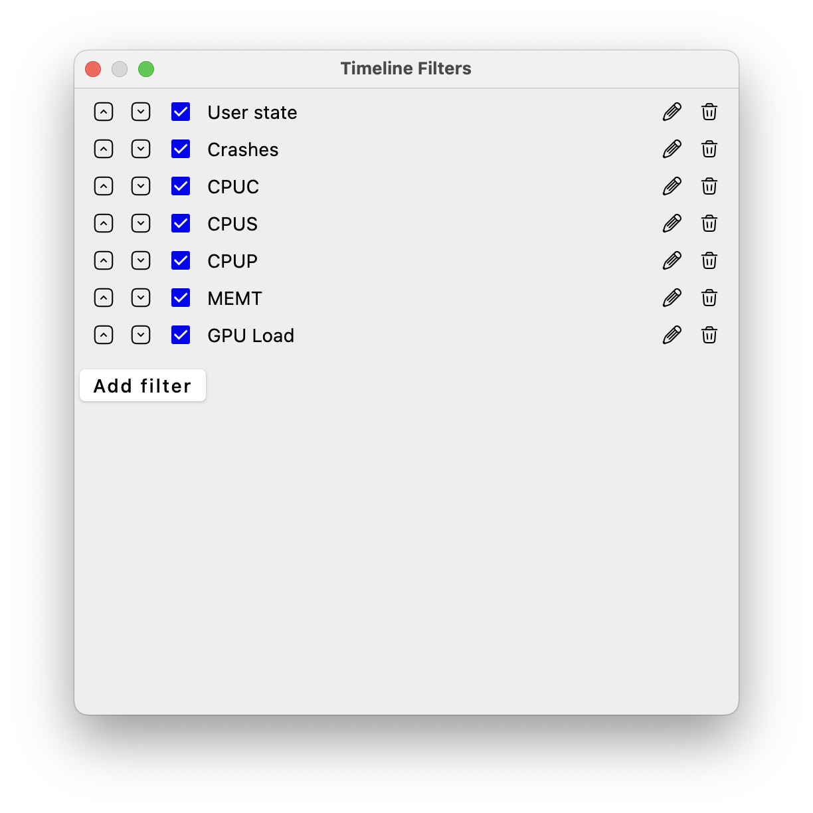
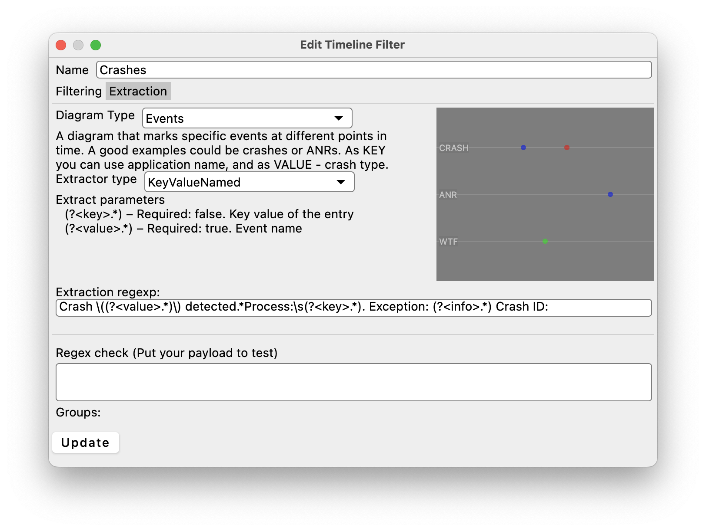
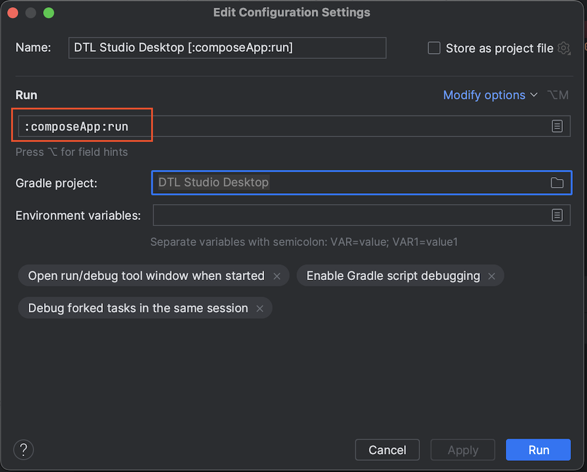

DLT logs analyzing app written with Compose Multiplatform for Desktop.

Logs/search

 

Logs color Filters

 

Timeline



Timeline filters

 

# Features
- Logs view screen
  - Adjustable font size and font family
  - Customizable and resizable columns
  - Customizable color filters that can be exported/imported
  - Plain text and regex search
  - Logs marking and filtering for marked logs
  - Commenting logs
  - Logs word wrapping
  - Apply time zone to logs
  - Logs removal based on criteria (App, Context, Ecu, Session, everything before/after)
  - Virtual device preview - renders rectangles of your views in virtual devices. 
- Timeline screen
  - Zoomable and movable timeline
  - Define your custom rules to extract data from logs and represent it as diagrams.
  - Export and import timeline rules.
- Plugins system
  - Write your own plugins and use them within the app (as source code or jar file) - do whatever you want with logs.
  - File plugin example - extracts files attached to logs. Preview text and images, other files can be saved as files.
  - Device analyze plugin example - execute different predefined adb commands and see results.

# Usage
Drag and drop your dlt files to the app or use menu.

To analyze timeline open/setup timeline filters and click green Play button.

# Run

IntelliJ IDEA / Android Studio

1. New -> Project from Version Control -> Specify clone Url

2. Add new Gradle configuration and specify run task


3. Click 'Run'

or in terminal run command:
```
./gradlew :desktop-app:run
```


# Distribute

Depending on the platform run one of the following tasks:
```
./gradlew packageDmg
./gradlew packageExe
./gradlew packageDeb
./gradlew packageMsi
```

Learn more about [Kotlin Multiplatform](https://www.jetbrains.com/help/kotlin-multiplatform-dev/get-started.html)…

# Inspect Composable stability
```
./gradlew assemble -Pcom.alekso.dltstudio.android.enableComposeCompilerReports=true -Pcom.alekso.dltstudio.android.enableComposeCompilerMetrics=true --rerun-tasks
```
