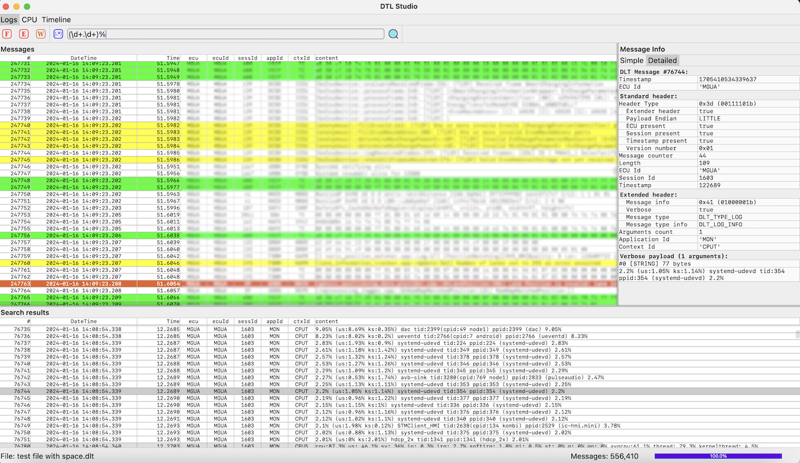
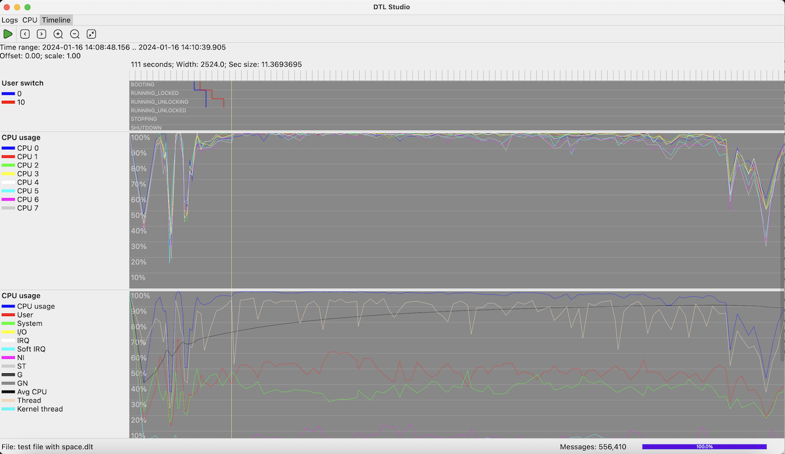

A very simple desktop DLT logs analizing app written with Compose Multiplatform.
 

# Features
- Logs view screen
  - Plain text and regex search by Payload (so far)
  - DLT message Simple and Detailed info panel
  - Warn, Error and Fatal messages color filters with toggle buttons
  - Custom color filters (soon will be customizable with UI)
- Zoomable and movable timeline screen
  - Users switch state view
  - CPUC and CPUS views which show CPU usage
  - Custom timeline views - currently implemented 'CPU usage by process' and 'Memory usage by process' views (soon will be customizable with UI)

# Usage
Just drag and drop your dlt files to the app.

# Run
```
./gradlew :composeApp:run
```

# Distribute
```
./gradlew packageDmg
```

Learn more about [Kotlin Multiplatform](https://www.jetbrains.com/help/kotlin-multiplatform-dev/get-started.html)…
