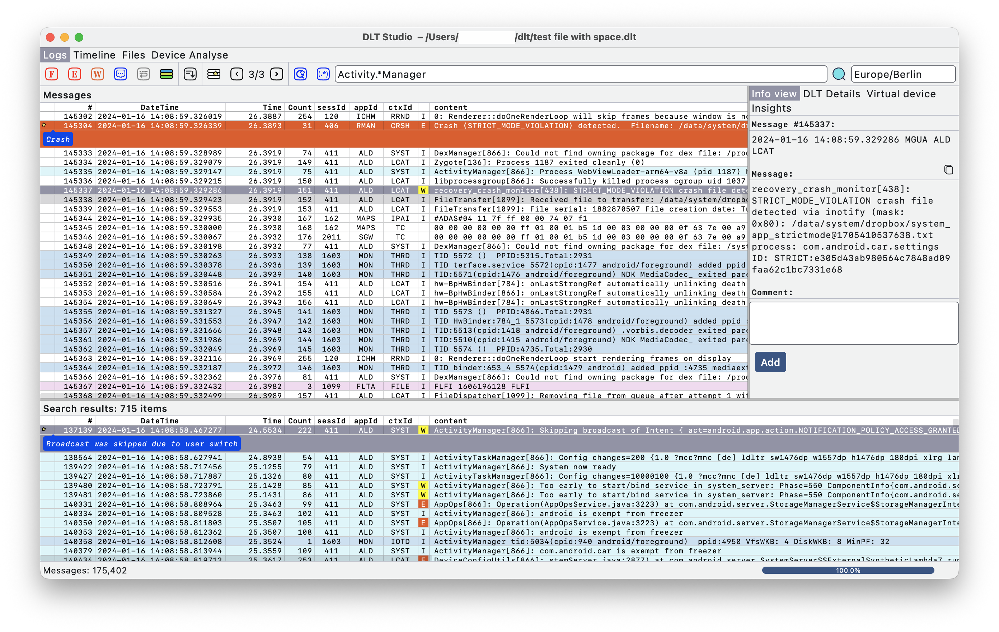
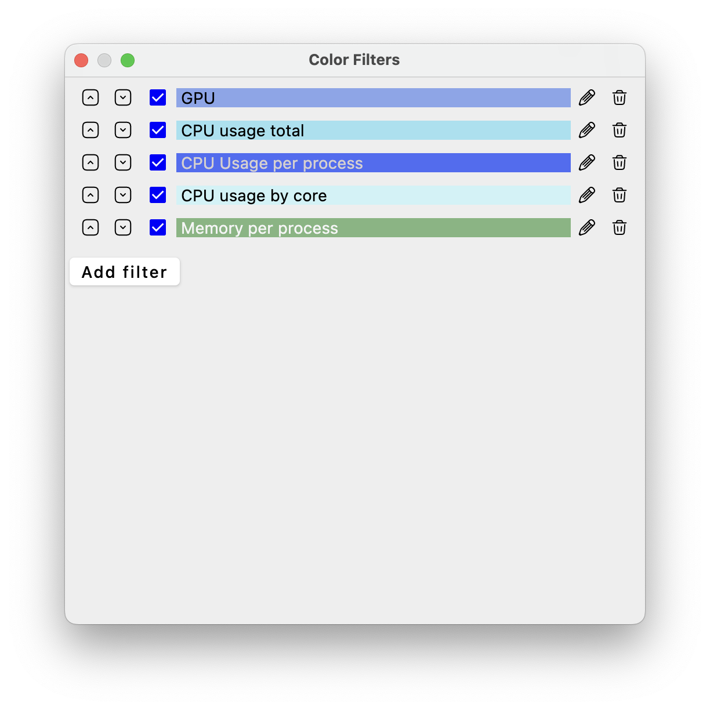
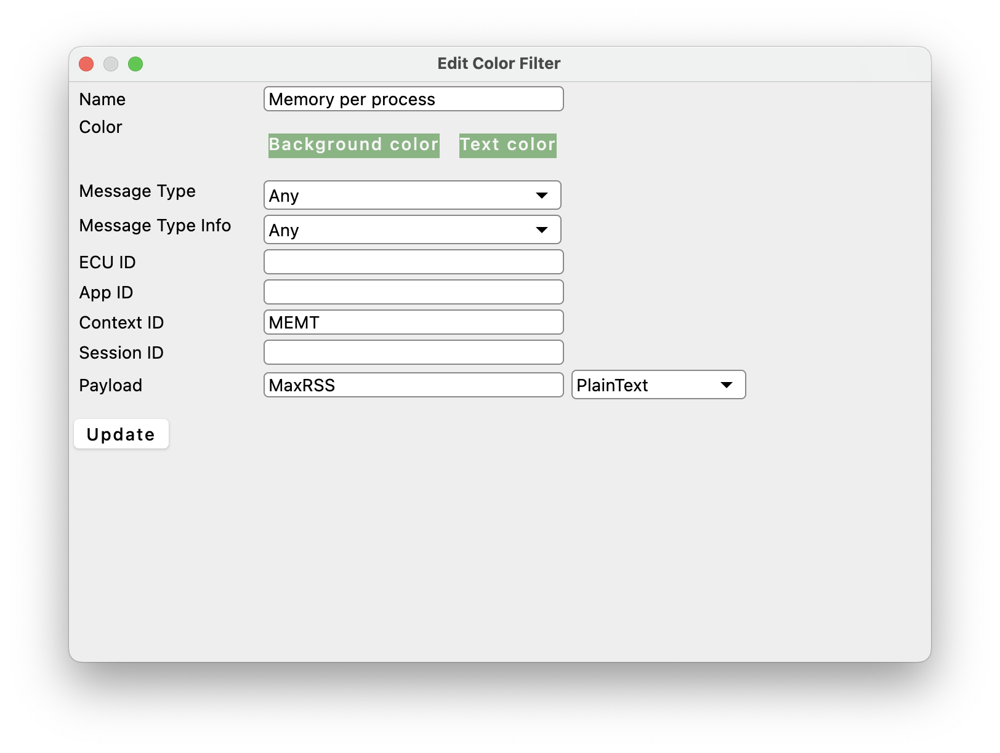
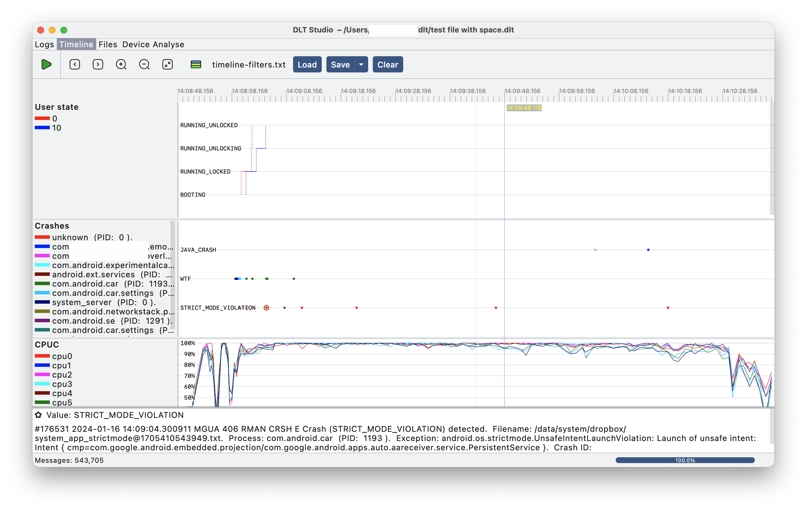
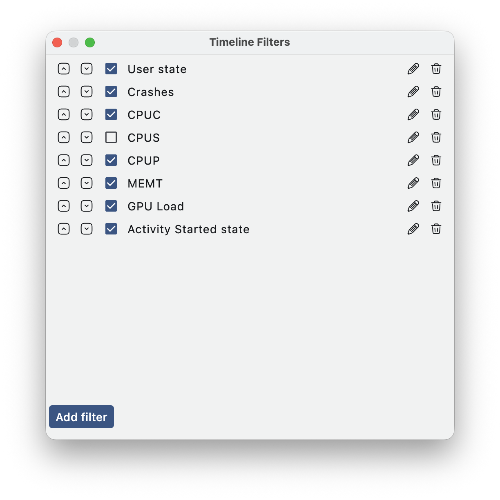
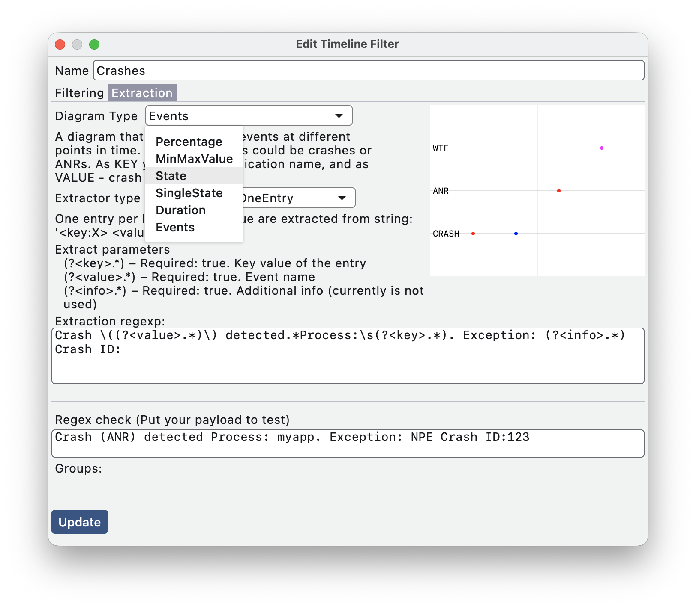

# DLT Studio

DLT (Diagnostic Log and Trace) logs analyzing application written with Compose Multiplatform for Desktop.

## Screenshots

### Logs View & Search
 

### Color Filters
 

### Timeline Analysis


### Timeline Filters
 

## Features

- **High-Performance Parsing**: Optimized DLT message parsing with string interning.
- **Advanced Logs View**:
  - Adjustable font size and font family.
  - Customizable and resizable columns.
  - Flexible color filters (exportable/importable).
  - Powerful search: Plain text and Regex.
  - Log marking, filtering, and commenting.
  - Word wrapping and time zone adjustments.
  - Advanced log cleanup/removal based on App, Context, Ecu, or Session.
- **Timeline Engine**:
  - Interactive, zoomable, and movable timeline.
  - Custom extraction rules to transform logs into visual diagrams.
  - Rule set import/export.
- **Extensible Plugin System**:
  - Load plugins from source code or JAR files.
  - **Included Plugins**:
    - **Detailed View**: Deep dive into message headers and payload.
    - **Files Viewer**: Extract and preview files (images, text) attached to DLT logs.
    - **Log Insights**: Automatically detect patterns and issues.
    - **Virtual Device**: Render UI view hierarchies from logs.
    - **Device Analyze**: Integrated ADB command execution and result viewing.
    - **Timeline**: Integrated diagram generation.

## Getting Started

### Usage
Simply **drag and drop** your `.dlt` files into the application or use the **File** menu to open them.

To start a timeline analysis:
1. Open/setup your timeline filters.
2. Click the green **Play** button.

### Development

#### Requirements
- IntelliJ IDEA or Android Studio.
- JDK 17 or higher.

#### Running from IDE
1. `New` -> `Project from Version Control` -> Specify the clone URL.
2. Create a new **Gradle** run configuration with the `run` task for `:desktop-app`.
3. Click **Run**.

#### Running from Terminal
```bash
./gradlew :desktop-app:run
```

## Distribution

To package the application for your platform:

| Platform | Command |
| :--- | :--- |
| **macOS (DMG)** | `./gradlew packageDmg` |
| **Windows (EXE)** | `./gradlew packageExe` |
| **Windows (MSI)** | `./gradlew packageMsi` |
| **Linux (Debian)** | `./gradlew packageDeb` |

## Technical Details


### Inspecting Compose Stability
```bash
./gradlew assemble -Palexey.odintsov.dltstudio.android.enableComposeCompilerReports=true -Palexey.odintsov.dltstudio.android.enableComposeCompilerMetrics=true --rerun-tasks
```

---
Learn more about [Compose Multiplatform](https://www.jetbrains.com/lp/compose-multiplatform/).
